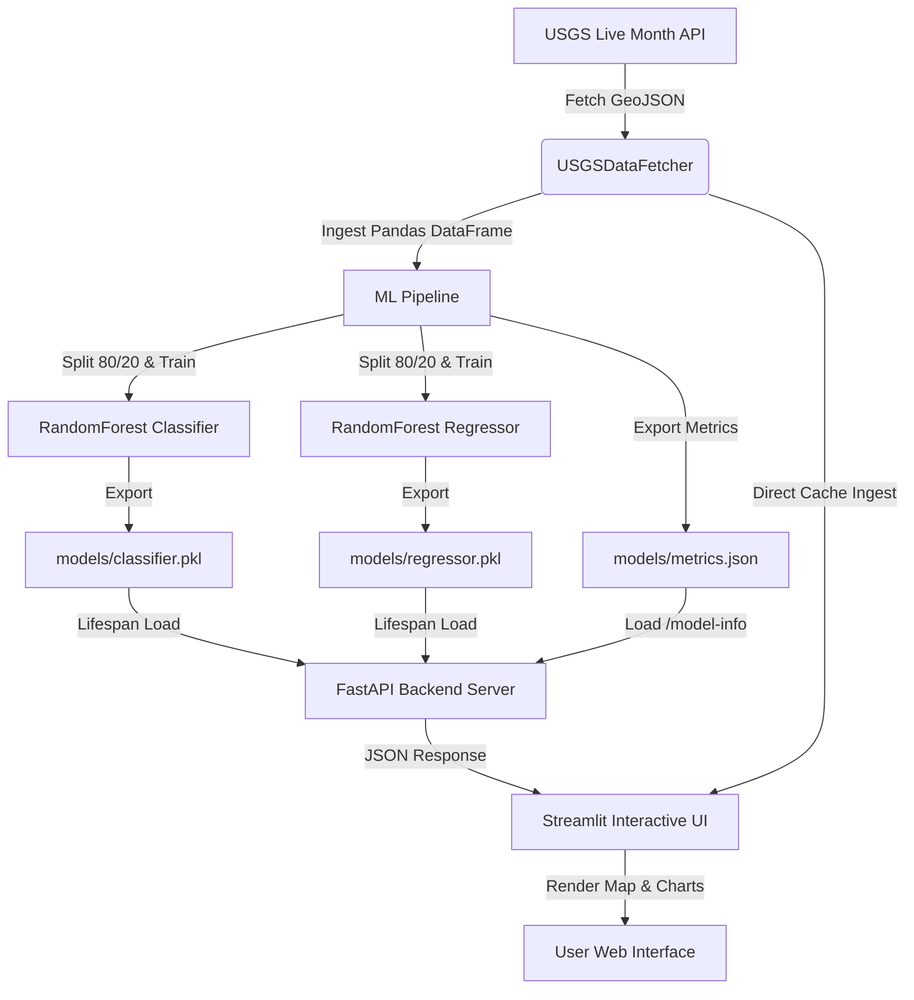

# 🌍 SeismoCast: Geospatial Seismic Predictor & Analytical Dashboard

[](https://python.org)
[](https://fastapi.tiangolo.com)
[](https://streamlit.io)
[](https://scikit-learn.org)
[](https://www.docker.com)
[](https://docs.pytest.org)

SeismoCast is a production-grade machine learning system designed to ingest seismic data in real time, train regression and classification models, and serve predictive analysis through a high-performance REST API and an interactive geospatial frontend dashboard.

---

## 🛠️ Architecture & Data Flow



---


1. **Dual-Task Modeling Pipeline**: Trains two separate Random Forest models (Classification for high-risk threshold risk assessments and Regression for continuous Richter scale magnitude calculation).
2. **Robust Validation & Evaluation Strategy**: Implements stratified test splitting (`train_test_split`) to counter class imbalances for high seismic risks, exporting precision, recall, F1, accuracy, MAE, RMSE, and R² scores.
3. **Pydantic Request/Response Schemas**: Standardizes input and output validation inside FastAPI endpoints, eliminating runtime type errors.
4. **FastAPI Lifespan Model Management**: Avoids runtime overhead by loading serialized models into memory once at application startup.
5. **Interactive Spatial Analytics Frontend**: Integrates Folium mapping overlaying live USGS historical monthly earthquake circles (scaled by magnitude) alongside the prediction targets.
6. **Self-Documenting API**: Exposes a `/model-info` metadata endpoint retrieving training-run evaluation metrics to show system transparency.
7. **Automated Testing Suite**: Implements unit and edge case validation testing with `pytest` and `fastapi.testclient.TestClient`.
8. **Containerized Orchestration**: Includes `Dockerfile` and `docker-compose.yml` to spin up both services in a shared network environment.

---

## 📂 Project Structure

```
seismocast/
├── app/
│   └── streamlit_app.py      # Streamlit Frontend Dashboard
├── src/
│   ├── api/
│   │   └── main.py           # FastAPI Production Backend Server
│   ├── data/
│   │   └── fetch_data.py     # USGS Live Data Fetcher & Ingestion
│   ├── models/
│   │   └── train_models.py   # ML Training Pipeline & Evaluator
│   └── utils/
│       └── config.py         # Configuration Manager
├── tests/
│   └── test_api.py           # Pytest Endpoint Test Suite
├── models/
│   ├── classifier.pkl        # Serialized Classifier
│   ├── regressor.pkl         # Serialized Regressor
│   └── metrics.json          # Out-of-sample Metrics Report
├── Dockerfile                # Image Build Configurations
├── docker-compose.yml        # Orchestration Configuration
└── requirements.txt          # Python Dependencies
```

---

## 🚀 Step-by-Step Manual Setup

Follow these steps to run the training pipeline, API backend, and Streamlit frontend manually.

### Step 1: Environment Setup
Ensure you are in the project root directory and activate your virtual environment:
```bash
# Activate the virtual environment
source .venv/bin/activate

# Install dependencies (if not already done)
pip install -r requirements.txt
```

### Step 2: Run the Model Training Pipeline
Fetch live USGS data, train the Random Forest models, evaluate performance, and serialize the outputs:
```bash
python -m src.models.train_models
```
*Expected Output*: Generates `models/classifier.pkl`, `models/regressor.pkl`, and `models/metrics.json` inside the root directory.

### Step 3: Run the FastAPI Server
Start the backend inference API server:
```bash
uvicorn src.api.main:app --host 127.0.0.1 --port 8000 --reload
```
* **API Documentation**: Visit http://127.0.0.1:8000/docs to view interactive Swagger docs.
* **API Health Check**: http://127.0.0.1:8000/

### Step 4: Run the Streamlit Dashboard
In a **new terminal tab** (activating `.venv` first), start the frontend application. Ensure `PYTHONPATH` is set so python can resolve module imports:
```bash
# Set PYTHONPATH and launch Streamlit
PYTHONPATH=. streamlit run app/streamlit_app.py --server.port 8501
```
* **Access the UI Dashboard**: Visit http://localhost:8501 in your browser.

### Step 5: Run Automated Tests
Validate that endpoints, input boundary checks, and request parsing are functioning properly:
```bash
PYTHONPATH=. pytest tests/
```

---

## 🐳 Running inside Containers (Docker Compose)

If you have Docker installed, you can spin up the entire system with one command:
```bash
docker-compose up --build
```
This command automatically:
1. Builds the image from the `Dockerfile`.
2. Spins up the `api` container on port `8000`.
3. Spins up the `streamlit` container on port `8501` communicating with the backend container via container routing.
